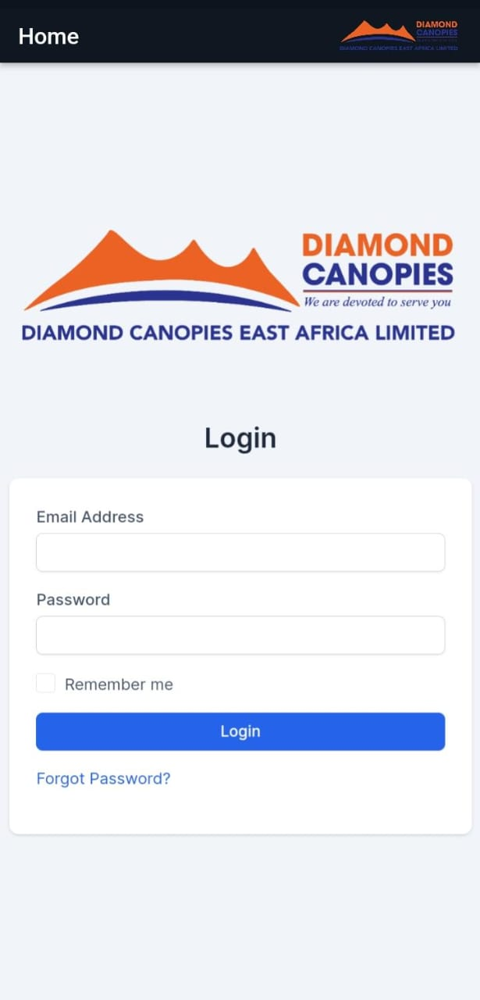

# [dc_systems App](https://creativetimofficial.github.io/dc_systems-flutter/docs/#) [](https://twitter.com/intent/tweet?text=Start%20Your%20Development%20With%20A%20Badass%20Flutter%20app%20inspired%20by%20dc_systems%20Design%20System.%0Ahttps%3A//demos.creative-tim.com/dc_systems-flutter/)


   [](https://github.com/dc_systems/dc_systems-flutter/issues?q=is%3Aopen+is%3Aissue) [](https://github.com/creativetimofficial/dc_systems-flutter/issues?q=is%3Aissue+is%3Aclosed)


dc_systems App is a free mobile UI betting App [Flutter](https://flutter.dev/) with powerful and beautiful mobile ui.. 
We have redesigned all the usual components in order to make it look , minimalistic and easy to use.

This is a badAss ui
### FULLY CODED COMPONENTS

dc_systems Fluttter features over 100 variations of widgets like buttons, inputs, cards, navigations etc, giving you the freedom of choosing and combining. All components can take variations in colour, that you can easily modify inside our theme file.

You will save a lot of time going from prototyping to full-functional code, because all elements are implemented. We wanted the design process to be seamless, so switching from image to the real page is very easy to do.

### Widgets & Cards
dc_systems APP Flutter comes packed with a large number of components and cards. Putting together a mobile app has never been easier than matching together different widgets. From the profile screen to a settings screen, you can easily customise and build your screens. I have created multiple options for you to put together and customise into pixel perfect screens. 

View [ all widgets/cards here](https://dc_systems.com).

### Example Screens
If you want to get inspiration or just show something directly to your clients, you can jump start your development with our pre-built example screens. From onboarding screens to profile or discover screens, you will be able to quickly set up the basic structure for your Flutter mobile project. 

View [all screens here](https://demos.creative-tim.com/dc_systems-flutter/index.html#screens?ref=dc_systems-flutter-readme).


Let us know your thoughts below. And good luck with development!


## Table of Contents

* [Versions](#versions) 
* [Demo](#demo)
* [Quick Start](#quick-start)
* [Documentation](#documentation)
* [File Structure](#file-structure)
* [OS Support](#os-support)
* [Resources](#resources)
* [Reporting Issues](#reporting-issues)
* [Technical Support or Questions](#technical-support-or-questions)
* [Licensing](#licensing)
* [Useful Links](#useful-links)

## Versions

[](https://www.creative-tim.com/product/dc_systems-design-system)[](https://www.creative-tim.com/product/vue-dc_systems-design-system)[](https://www.creative-tim.com/product/dc_systems-design-system-react)[](https://www.creative-tim.com/product/dc_systems-pro-react-native)


| HTML | React |
| --- | --- 
| [](https://www.creative-tim.com/product/dc_systems-design-system?ref=dc_systems-flutter-readme)  | [](https://www.creative-tim.com/product/dc_systems-design-system-react?ref=dc_systems-flutter-readme) 

## Demo

| Home Screen 
| --- 
| []  |

- [Start page](https://github.com/jaydto/dc_systems-flutter-app/tree/master/screenshots/home.png)
- [How to install our product](https://github.com/jaydto/dc_systems-flutter-app/tree/master/README.md)
- [Reporting issues](https://github.com/jaydto/dc_systems-flutter-app/tree/master/ISSUE_TEMPLATE.md)

[View more]

## Quick start
- Download this from [dc_systems App](https://dc_systems.com/app)


## Documentation
The documentation for the dc_systems APP Flutter is hosted at our [website](https://dc_systems.com)


## File Structure
Within the download you'll find the following directories and files:

```
.
├── LICENSE.md
├── README.md
├── analysis_options.yaml
├── dc_systems_app.iml
├── flutter_01.log
── lib
│   ├── constants
│   │   └── Theme.dart
│   ├── main.dart
│   ├── screens
│   │   └── DcSystems.dart
│   ├── utils
│   │   └── route-observer.dart
│   └── widgets
│       └── custom_navbar.dart
├── pubspec.lock
├── pubspec.yaml
└── test
    └── widget_test.dart
```


## OS Support

At present, we officially aim to support the last two versions of the following operating systems:

[](https://www.creative-tim.com/product/material-kit-pro-react-native)[](https://www.creative-tim.com/product/material-kit-pro-react-native)


## Resources
- Demo: <https://test.dc_systems.co.ke>
- Download Page: <https://test.dc_systems.co.ke>
- Documentation: <https://demos.creative-tim.com/dc_systems-flutter/docs?ref=dc_systems-flutter-readme>
- License Agreement
- Support: <johnckaris@gmail.com>
- Issues: [Github Issues Page](https://dc_systems.com)
- [dc_systems Design System]()) - For Front End Development
- **Dashboards:**


## Reporting Issues

We use GitHub Issues as the official bug tracker for the dc_systems APP Flutter. Here are some advices for our users that want to report an issue:

1. Make sure that you are using the latest version of the dc_systems APP Flutter.
2. Providing us reproducible steps for the issue will shorten the time it takes for it to be fixed.
3. Some issues may be platform specific, so specifying on what platform you encountered the issue might help.


### Technical Support or Questions

If you have questions or need help integrating the product please [contact us](0795983399) instead of opening an issue.


## Licensing

- Copyright 2023 John Chege (https://www.creative-tim.com/?ref=dc_systems-flutter-readme)

- Licensed under [MIT](https://github.com/dc_systems-app/dc_systems-flutter/blob/master/LICENSE.md)


## Useful Links


### Social Media

Twitter: <https://twitter.com/jaydt8>

Facebook: <https://www.facebook.com/jaydt8>

Dribbble: <https://dribbble.com/jaydt8>

Google+: <https://plus.google.com/+jaydt8>

Instagram: <https://www.instagram.com/jaydt8>


